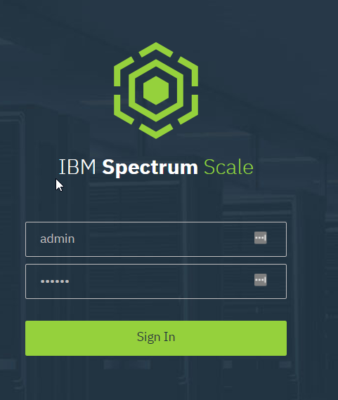

# IBM Spectrum Scale 5.0 Single Node Installation

## Objective
> Single node Spectrum Scale deployment with NSD, GUI and NFS services


## Software

* CentOS 7 Generic Cloud Image : http://cloud.centos.org/centos/7/images/CentOS-7-x86_64-GenericCloud.qcow2

* IBM Spectrum Scale https://www.ibm.com/au-en/marketplace/scale-out-file-and-object-storage


## Official Documentation

Installing IBM Spectrum Scale on Linux nodes https://www.ibm.com/support/knowledgecenter/STXKQY_5.0.4/com.ibm.spectrum.scale.v5r04.doc/bl1ins_loosein.htm


## Pre-requisites

1. Create CentOS 7 Server with 2 CPU, 8 GB RAM and 50GB OS disk
   ```
   name=scale01
   cpu=2
   ram=8

   mkdir vm_${name}
   qemu-img create -f qcow2 -b ${CENTOS7_IMAGE} vm_${name}/${name}.qcow2 50G

   virt-install --name ${name}\
    --cpu host-passthrough --vcpus ${cpu}\
    --ram $((${ram}*1024))\
    --disk path=/vmdata/vm_${name}/${name}.qcow2,format=qcow2\
    --network network=default\
    --os-type linux --os-variant centos7.0\
    --graphics vnc\
    --noautoconsole\
    --boot hd
   ```

2. Create and attach 100GB data disk to server
   ```
   qemu-img create -f raw vm_${name}/data.img 100G

   virsh attach-disk --source $(pwd)/vm_${name}/data.img \
    --target vdb\
    --targetbus virtio\
    --driver qemu\
    --subdriver raw\
    --cache none\
    --type disk\
    --live\
    --persistent\
    ${name}
   ```
   
3. Disable `firewalld` service

4. (Optional) Set **SELinux** in `Enforcing ` mode

5. It is **IMPORTANT** to make sure host's FQDN and 'localhost' and IP address mapping is consistent in both directions (forward and reverse).  'localhost' is used by Spectrum Scale GUI service to connect to its PostgreSQL database. 

   ```
   getent hosts $(hostname -f)
   getent hosts <ip_from_output_of_above_command>
   
   getent hosts localhost
   getent hosts <ip_from_output_of_above_command>
   ```

   

## Infrastructure details

| FQDN                | IP Address      | Data disk name |
| ------------------- | --------------- | -------------- |
| scale01.homelab.net | 192.168.122.116 | /dev/vdb       |

## Steps

### Spectrum Scale and GUI installation

1. Update OS and reboot

   ```bash
   yum update -y && reboot
   ```

2. Make sure NTP service is running correctly

3. Update `/etc/sysctl.conf.d/99-spectrum.conf` [Reference](https://www.ibm.com/support/knowledgecenter/STXKQY_5.0.4/com.ibm.spectrum.scale.v5r04.doc/bl1ins_netperf.htm)

   ```
   # increase Linux TCP buffer limits
   net.core.rmem_max = 8388608
   net.core.wmem_max = 8388608
   # increase default and maximum Linux TCP buffer sizes
   net.ipv4.tcp_rmem = 4096 262144 8388608
   net.ipv4.tcp_wmem = 4096 262144 8388608
   ```

4. Install the dependencies

   ```bash
   yum install -y gcc kernel-devel kernel-headers \
    kernel m4 gcc-c++ ksh numactl net-tools \
    openldap-clients python-xml
   ```

5. Copy and unpack Spectrum Scale Linux installation file.

   ```bash
   chmod +x Spectrum_Scale_Data_Management-5.0.4.0-x86_64-Linux-install
   ./Spectrum_Scale_Data_Management-5.0.4.0-x86_64-Linux-install --silent
   ```

   This will unpack the installer at `/usr/lpp/mmfs/5.0.4.0/installer/` directory

   You can also find some useful tips at `/usr/lpp/mmfs/5.0.4.0/installer/documentation/README` 

6. Update `/etc/hosts` file to add an entry for server's FQDN and localhost mapping

   In my test environment this is entry I added

   ```
   192.168.122.177 scale01.homelab.net
   ```

   ⚠️ **Add server's FQDN ONLY at this step**

   Update localhost mapping. The **exact** localhost* mappings are required for postgresql authentication used by Spectrum Scale GUI. 

   ```
   127.0.0.1   localhost localhost.localdomain localhost4 localhost4.localdomain4
   ::1         localhost localhost.localdomain localhost6 localhost6.localdomain6
   ```

7. Create SSH keys and setup key based authentication to itself as `root` user

   ```bash
   ssh-keygen -t rsa -f /root/.ssh/id_rsa -N ''
   
   ssh-copy-id root@$(hostname -f)
   ```

8. Install Spectrum Scale

   ```bash
   # add following PATH configuration to ~/.bash_profile
   export PATH=/usr/lpp/mmfs/5.0.4.0/installer:/usr/lpp/mmfs/bin:$PATH
   
   # config cluster name
   spectrumscale config gpfs -c c01.homelab.net
   
   # '192.168.122.116' is the IP address of this server
   spectrumscale setup -st ss -i /root/.ssh/id_rsa -s 192.168.122.116
   
   # add node with admin (-a), GUI (-g), quorum (-q) and NSD (-n) roles
   spectrumscale node add $(hostname -f) -a -g -q -n
   
   # disable callhome
   spectrumscale callhome disable
   
   # start installation
   spectrumscale install
   ```

   hopefully the installation will completed successfully and you get output similar to the one below

   ```
   ...
   [ INFO  ] SUCCESS
   [ INFO  ] All services running
   [ INFO  ] StanzaFile and NodeDesc file for NSD, filesystem, and cluster setup have been saved to /usr/lpp/mmfs folder on node: scale01.homelab.net
   [ INFO  ] Installation successful. 1 GPFS node active in cluster c01.homelab.net. Completed in 6 minutes 53 seconds.
   [ INFO  ] Tip :If all node designations and any required protocol configurations are complete, proceed to check the deploy configuration:./spectrumscale deploy --precheck
   ```

9. Create NSD [Reference](https://www.ibm.com/support/knowledgecenter/STXKQY_5.0.4/com.ibm.spectrum.scale.v5r04.doc/bl1ins_manuallyinstallingonlinux_NSDs.htm)

   a. create stanza file `NSD.conf` as follow

   ```
   %nsd:
           device=/dev/vdb
           nsd=nsd1
           servers=scale01.homelab.net
           usage=dataAndMetadata
           failureGroup=1
           pool=system
   ```

   b. create NSD and filesystem.
   [mmcrnsd](https://www.ibm.com/support/knowledgecenter/en/STXKQY_4.2.0/com.ibm.spectrum.scale.v4r2.adm.doc/bl1adm_mmcrnsd.htm)

   [mmcrfs](https://www.ibm.com/support/knowledgecenter/en/STXKQY_4.2.0/com.ibm.spectrum.scale.v4r2.adm.doc/bl1adm_mmcrfs.htm)

   ```
   mmcrnsd -F NSD.conf
   mmcrfs fs01 -F NSD.conf -k nfs4
   ```

   c. mount filesystem

   ```
   mmount
   ```

   d. verify mount point by running `df -h` command

10. Access GUI
    a. create GUI user

    ```
    # /usr/lpp/mmfs/gui/cli/mkuser admin -g SecurityAdmin
    EFSSG1007A Enter password for User :
    ```

    b. Access GUI by pointing your browser to `https://<scale_server_ip>`
    


### Enabling CES (Cluster Export Services) [Ref](https://www.ibm.com/support/knowledgecenter/STXKQY_5.0.4/com.ibm.spectrum.scale.v5r04.doc/bl1ins_manuallyinstallingonlinux_CES.htm)

1. Seting up CES shared root filesystem

   ```
   mmchconfig cesShareRoot=/gpfs/fs01
   ```

2. Add server as CES node

   ```
   mmchnode -N scale01.homelab.net --ces-enable
   ```

   verify result

   ```
   mmces node list
   mmlscluster --ces
   ```

3. Add CES IP. **Note**, the CES IP address must has reverse lookup record (i.e. PTR record) in DNS

   ```
   mmces address add --ces-ip 192.168.122.10
   ```

### Enabling NFS service

1. Install NFS packages and enable NFS service

   ```
   yum localinstall -y /usr/lpp/mmfs/5.0.4.0/ganesha_rpms/rhel7/*rpm
   mmces service enable NFS
   ```
   
   
   
2. Install NFS performance monitoring [Ref](https://www.ibm.com/support/knowledgecenter/STXKQY_5.0.4/com.ibm.spectrum.scale.v5r04.doc/bl1ins_manualinstallationofPMTl.htm)

   ```
   yum localinstall -y /usr/lpp/mmfs/5.0.4.0/zimon_rpms/rhel7/gpfs.pm-ganesha-10.0.0-1.el7.x86_64.rpm
   ```

   create `/opt/IBM/zimon/defaults/ZIMonSensors_nfs.cfg` with content below

   ```
   sensors={
           name = "NFSIO"
           period = 10
           type = "Generic"
           restrict = "cesNodes"
   }
   ```

   add sensor

   ```
   mmperfmon config add --sensors /opt/IBM/zimon/defaults/ZIMonSensors_nfs.cfg
   ```

   add sensor to system

   ```
   mmhealth node show nfs --refresh
   ```

3. Create File Authentication Service in **GUI** under **Serviecs** > **File Authentication**. Create service as 'user-defined'

   ```
   # or from CLI
   mmuserauth service create --data-access-method 'file' --type 'USERDEFINED'
   ```

4. Create fileset for NFS export in GUI under **Files** > **Filesets**

5. Create NFS export in GUI under **Protocols** > **Create Export**. If you encounter a GUI bug which doesn't allow you to add NFS clients, you need to reboot server and try again. 